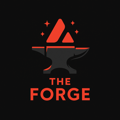

# Avax Forge Empire - Pitch Deck

**Tagline:** The Gamified Social Hub of Web3. Build, Engage, Earn.

---

## Slide 1: Title

# Avax Forge Empire

### The Gamified Social Hub of Web3. Build, Engage, Earn.

--- 

## Slide 2: The Problem

### Web3 is Fragmented, Transactional, and Intimidating.

*   **Siloed Experience:** Users constantly jump between disconnected dApps for social, gaming, and DeFi. There is no central hub for their digital life.

*   **Lack of Stickiness:** Engagement is purely transactional. Users come for a specific purpose (e.g., a trade) and leave. There's little to retain them or build a loyal community.

*   **High Barrier to Entry:** Onboarding new users into Web3 is a complex and confusing process, hindering mass adoption.

--- 

## Slide 3: The Solution

### A Unified, Gamified, and User-Owned Ecosystem.

Avax Forge Empire is a single, seamless platform on the Avalanche blockchain that integrates SocialFi, GameFi, and DeFi.

*   **Unified Hub:** We combine social networking, dynamic quests, staking, and governance into one cohesive experience. Your identity and actions are portable across the entire ecosystem.

*   **Deep Engagement:** Our core XP Engine, Badge system, and Streaks create a powerful gamification loop that rewards users for every interaction, fostering long-term retention.

*   **Effortless Onboarding:** Our progressive `OnboardingQuests` system guides new users through their first steps in Web3, making it rewarding and easy to get started.

--- 

## Slide 4: The Vision

### To Build the Digital Nation of Web3.

Our vision is to create the premier SocialFi and GameFi destination on Avalanche, a place where your on-chain identity and reputation have real value and utility.

We are not just building a dApp; we are building a user-owned, decentralized economy. The ultimate goal is a self-sustaining digital nation, governed by its citizens through the **CommunityDAO**.

--- 

## Slide 5: Market Opportunity

### At the Intersection of Three Massive, High-Growth Markets.

We are strategically positioned to capture users from three booming sectors:

1.  **SocialFi:** The next evolution of social media, where users own their data and are rewarded for their engagement. *(Market Size: Projected to exceed $100B)*

2.  **GameFi:** Revolutionizing the gaming industry by empowering players with true ownership of in-game assets and a share in the economy. *(Market Size: $40B+ and growing)*

3.  **DeFi on Avalanche:** A fast, low-cost, and vibrant ecosystem perfect for building complex, high-throughput applications. *(Avalanche TVL: $Billions)*

Our target user is the modern Web3 native who demands more than just a wallet—they want an immersive and rewarding experience.

--- 

## Slide 6: The Platform - A Unified Experience

Our modular architecture is built on four key pillars:

*   **IDENTITY & REPUTATION:**
    *   **`ProfileRegistry`**: Create your unique on-chain identity.
    *   **`XPEngine`**: Earn Experience Points for every action.
    *   **`BadgeMinter`**: Mint non-transferable badges to showcase your achievements.

*   **ENGAGE & SOCIALIZE:**
    *   **`SocialGraph`**: Follow users, create posts, and build your network.
    *   **`Kudos` & `TipJar`**: Show appreciation and reward other users.

*   **PLAY & EARN:**
    *   **`QuestRegistry` & `DynamicQuestEngine`**: Embark on personalized quests.
    *   **`StreakSystem`**: Maintain daily streaks for bonus rewards.
    *   **`SeasonalEvents`**: Compete in platform-wide events.

*   **INVEST & GOVERN:**
    *   **`ForgeTokenCore ($FORGE)`**: The heart of our economy.
    *   **`StakingRewards`**: Stake your $FORGE to earn yield.
    *   **`CommunityDAO`**: Govern the future of the Empire.

--- 

## Slide 7: Traction & Progress

### We Build First. We've Already Laid the Foundation.

*   **Architecture Complete:** The core protocol architecture, featuring over 30 interconnected, upgradeable contracts, is complete.

*   **Phase 1 Deployed & Verified:** The foundational layer (`XPEngine`, `BadgeMinter`, `ProfileRegistry`, `OnboardingQuests`) is live and fully verified on the Fuji testnet, demonstrating our ability to execute.

*   **Security-Focused:** The project has been built from the ground up with security in mind, featuring an extensive test suite (>95% coverage) and a preliminary security review.

*   **Strategic Rollout:** A detailed, 4-phase gradual rollout plan is in place to ensure a secure, stable, and community-focused launch.

--- 

## Slide 8: Tokenomics & Utility ($FORGE)

### The Lifeblood of the Empire.

**$FORGE** is the native ERC20 utility and governance token of the Avax Forge Empire.

*   **UTILITY:**
    *   **Governance:** Stake $FORGE to create and vote on proposals in the CommunityDAO.
    *   **Staking:** Earn a share of protocol rewards by staking $FORGE tokens.
    *   **Access:** Unlock premium features, exclusive quests, and event access with the `ForgePass` NFT, which is purchasable with $FORGE.
    *   **Medium of Exchange:** The primary currency for the `MarketplaceCore` and for tipping within the ecosystem.

*   **VALUE ACCRUAL:**
    *   Platform fees from `TokenLauncher` and `MarketplaceCore` will be directed to the DAO treasury.
    *   The DAO can vote to use treasury funds for buybacks, burns, ecosystem grants, or further development, creating a self-sustaining economic loop.

--- 

## Slide 9: The Roadmap

### A Phased Approach to Building a Digital Nation.

*   **✅ Phase 1 (Complete):** Foundation & Core Loop
    *   *Deployed: XPEngine, BadgeMinter, ProfileRegistry, OnboardingQuests.*

*   **▶️ Phase 2 (Q4 2025):** Engagement & Social Expansion
    *   *Launch: SocialGraph, QuestRegistry, StreakSystem.*

*   **Phase 3 (Q1 2026):** Monetization & DeFi
    *   *Launch: $FORGE Token, StakingRewards, ForgePass.*

*   **Phase 4 (Q2 2026):** Full Decentralization & Governance
    *   *Launch: CommunityDAO, Marketplace, Guilds.*

--- 

## Slide 10: The Team

Avax Forge Empire is led by a dedicated team of experienced Web3 developers, designers, and community builders with a proven track record of delivering high-quality, secure, and engaging products in the blockchain space.

--- 

## Slide 11: The Ask

*(Placeholder - To be filled in with specific funding request)*

We are seeking **$500,000.00** in a seed round.

These funds will be used to:
*   Accelerate development of Phases 2 and 3.
*   Expand the core engineering and community management teams.
*   Fund a formal, third-party security audit.
*   Fuel initial marketing, user acquisition, and liquidity provisioning for the $FORGE token launch.

--- 

## Slide 12: Contact

### Let's Build the Future of Web3 Together.

**Avax Forge Empire**

**Email:** [email protected]

**Twitter:** [twitter.com/to-be-added]

**Website:** [to-be-added]
